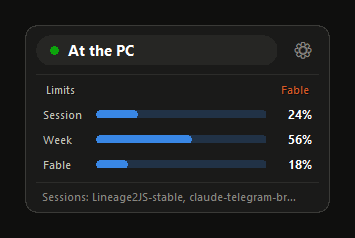

# Claude Code ↔ Telegram bridge

[English](README.md) · **Українська** · [Русский](README.ru.md)

Віддалене керування живими сесіями Claude Code з Telegram: опитування
приходять кнопками, підсумок ходу — текстом, відповідь із чату продовжує
роботу. Залежностей немає, лише стандартна бібліотека Python.



## Як це влаштовано

Розширення VSCode не дозволяє вставити повідомлення в сесію, що триває, тому
підключення йде через **хуки** — штатний механізм розширення Claude Code.

```
VSCode (сесія) --hook--> hookc.py --HTTP--> claudetg.daemon <--getUpdates--> Telegram
```

Демон потрібен тому, що потік оновлень бота може читати **лише один**
споживач: два вікна VSCode з одним токеном отримували б `409` і крали
відповіді одне в одного.

## Режим присутності

| Режим | Поведінка |
|---|---|
| **За ПК** (типово) | хуки шлють у чат лише те, що дозволено фільтром «За ПК: …» (можна — взагалі нічого), і одразу повертаються. Опитування — у VSCode, як звично. |
| **Не за ПК** | хуки блокують сесію і чекають на відповідь у Telegram. |

Перемикання — кнопка віджета, `/away` / `/here` у боті, або автоматично
за бездіяльністю (див. віджет).

## Події

| Хук | Що робить |
|---|---|
| `SessionStart` | реєструє сесію, створює топік проєкту, віддає накопичену чергу задач |
| `PreToolUse` (`AskUserQuestion`) | публікує опитування кнопками, чекає на вибір |
| `Stop` | шле підсумок ходу (проєкт · тривалість), чекає на наступну задачу |
| `PostToolUse` (`TodoWrite`) | список задач одним повідомленням, що **редагується на місці** |
| `PostToolUseFailure` | шле команди, що впали, з текстом помилки |
| `StopFailure` | хід обірвався помилкою API чи лімітом — повідомляє зі звуком |
| `UserPromptSubmit` | позначає початок ходу для сторожа зависань |
| `SessionEnd` | закриває сесію, додає git-зведення |

## Сторож, зведення, git

- **Сторож завислого ходу** — якщо хід триває довше за `watchdog.minutes`
  (типово 20) без завершення, приходить одне сповіщення; скидається на `Stop`.
- **Зведення за день** — о `daily_digest.hour` (типово 21:00) таблиця за
  проєктами: ходів, помилок, сумарний час.
- **Git-зведення** — при закритті сесії: гілка і що лишилося
  незакоміченим. У не-git проєктах мовчить. Вимикається `git_summary`.

## Живий потік

Текст приходить **у міру появи**, а не пачкою наприкінці ходу: демон читає
хвіст транскрипту раз на секунду і надсилає кожен готовий блок. Живі блоки
йдуть із `💬`, наприкінці ходу — короткий рядок `✅ Проєкт · 1м 47с`.

За ПК потік підпорядковується галочці «За ПК: живий потік тексту»; у режимі
«не за ПК» іде завжди. Якщо живих блоків не пішло (наприклад, демон підняли
посеред ходу), фінальне повідомлення прийде з повним текстом — вміст не
губиться ніколи.

## Віджет на робочому столі

`widget.pyw` — безрамкова темна картка поверх усіх вікон (Tkinter + ctypes,
без залежностей). Перетягується за будь-яке місце, кути заокруглені,
прозорість налаштовується.

- **Капсула-кнопка присутності**: 🟢 «Я за ПК», 🟡 «Не за ПК», 🔴 «Міст
  offline» (клік підніме демона). Підказка режиму — у тултіпі.
- **Метри лімітів**: 5-годинне і тижневе вікно, відсоток, час обнулення,
  колір за завантаженням (спокійний → жовтий ≥70% → червоний ≥90%).
  Перемикач **Стандарт ↔ Fable** обирає пул лімітів, а разом із ним і колір
  смужки: синій у Стандарта, помаранчевий у Fable.
- **Тривожне тло**: на ≥90% 5-годинного вікна картка стає тьмяно-червоною, на
  ≥90% тижневого — червоною. Тижневе перебиває сесійне: сесійне саме
  доллється, тижневе — ні.
- **Меню** (правий клік, шестірня або іконка в треї): Проєкти, Функції,
  Прозорість, Кліки крізь віджет, Авто «не за ПК», Сховати в трей, Закрити.
  Меню і вікна «Проєкти»/«Функції» — у тому ж темному стилі, зміни
  застосовуються одразу.
- **Кліки крізь віджет**: картка перестає ловити мишу взагалі й може висіти
  поверх редактора, не заважаючи. Назад — лише через іконку в треї (правий
  клік → те саме меню), бо клікнути по самій картці вже не можна.
- **Трей**: лівий клік — сховати/показати віджет, правий — меню.
- **Авто «не за ПК»**: після N хвилин бездіяльності (клавіатура+миша всієї
  системи) міст сам іде в away; повертає його лише **натискання клавіші** —
  зачеплена миша не висмикне сесію з Telegram. Ручне перемикання автоматика
  ніколи не скасовує.

## Залишок лімітів після кожного ходу

Окремим повідомленням у фіксований топік «Лимиты Claude»: заповненість
5-годинного і тижневого вікна плюс **час обнулення**.

Джерело даних — не веб-API claude.ai і не браузерна сесія, а
`statusline.py`: Claude Code передає статус-рядку поле `rate_limits` з
`used_percentage` і `resets_at` для вікон `five_hour` і `seven_day`. Хукам
це поле не віддається, тому статус-рядок кешує його в `usage.json`, а демон
і віджет читають кеш. Жодних облікових даних не потрібно.

Якщо версія Claude Code це поле не надсилає — повідомлення просто не
відправляється. Застарілий кеш (старший за `usage_report.max_age_seconds`)
теж ігнорується: краще промовчати, ніж показати цифри, яким не можна вірити.

## Вибір проєктів

Шляхи руками вводити не потрібно. Міст сам знаходить усі проєкти, про які
знає Claude Code (каталоги в `~/.claude/projects`), і показує списком —
свіжі згори, зі справжнім коренем і позначкою для мертвих:

- **у віджеті** — меню → «Проекты…», галочки застосовуються одразу;
- **у боті** — команда `/projects`, натискання перемикає підключення.

Позначений проєкт отримує свій топік. Список — це і є межа приватності:
**не позначений проєкт не надсилає в Telegram нічого**. Якщо хочеться, щоб
підхоплювався будь-який новий проєкт автоматично, є `auto_discover: true` —
але тоді назовні піде вміст усіх сесій на машині, включно з випадковими.

## Кілька робочих каталогів в одного проєкту

Claude часто йде працювати в сусідні дерева (тестові дані, клієнт гри,
референсний чекаут). Вони мають потрапляти в топік **свого** проєкту:

```bash
python install.py --add-path "C:/Users/Me/Desktop/core" --for ReverseL2
```

## Повернення керування

Якщо ти знімаєш режим «не за ПК», поки хук чекає на відповідь, **усі
очікування негайно звільняються** і керування повертається у VSCode: висяче
опитування знову з'явиться в редакторі, `Stop` просто віддасть хід. Вручну —
`/release`.

## Монітор status.claude.com

Окремий потік опитує статус-сторінку Anthropic раз на 5 хвилин і пише в
топік «Статус Claude», коли щось змінюється: загальний індикатор, стан
компонента, новий інцидент або його закриття. Збої приходять **зі звуком
навіть у режимі «за ПК»**. Перевірити вручну: `/claude_status`.

## Мови

Міст говорить 9 мовами: English, Українська, Русский, 한국어, 中文,
Tiếng Việt, Ελληνικά, Português, Español. Мова визначається за системою
автоматично; перемкнути — меню віджета → «Мова» або `"language"` у
`config.json`. Переклади — звичайні файли `lang/messages_*.properties`:
нова мова додається одним файлом, без коду.

## Встановлення

Завантаж **`ClaudeTelegram-Setup.exe`** зі
[сторінки релізів](https://github.com/bonuxq/claude-telegram-bridge/releases)
і запусти. Прав адміністратора не треба, Python не треба: інсталятор несе
середовище з собою і сам прописує хуки Claude Code.

Далі віджет сам відкриє екран налаштування: вставити токен бота (він
перевіряється в Telegram до збереження), створити супергрупу з увімкненими
**Темами**, додати бота адміністратором і надіслати в групі `/register`.

З джерел — теж можна, потрібен лише Python 3.9+:

```bash
python install.py                                   # хуки в ~/.claude/settings.json (з бекапом)
python -m claudetg.daemon                           # демон (або підніметься сам із хука)
python widget.pyw                                   # віджет
```

Деталі й розбір проблем — в [INSTALL.uk.md](INSTALL.uk.md), повний розбір
функцій — у [FEATURES.uk.md](FEATURES.uk.md).

## Команди бота

`/help` — список команд · `/register` — прив'язати групу ·
`/unregister` — зняти прив'язку · `/away`, `/here` — режим присутності ·
`/status` — живі сесії · `/queue` — накопичені задачі ·
`/claude_status` — стан сервісів Anthropic ·
`/release` — звільнити всі висячі очікування

Прив'язка одностороння: після неї `/register` із будь-якого іншого чату
ігнорується — знайти бота недостатньо, щоб відвести його звіти собі.

## Межі, про які варто знати

- **Очікування обмежене годиною.** Заміряно: хук із `timeout: 3600` тримає
  сесію повну годину і вона штатно дограє хід.
- **Відповідь пізніше за таймаут не губиться**: Telegram зберігає непрочитані
  апдейти близько доби, демон складає їх у чергу і віддає сесії при
  наступному `Stop` або `SessionStart`.
- **Відповідь на `AskUserQuestion` віддається через `deny` +
  `permissionDecisionReason`** — у транскрипті виклик виглядає як
  відхилений, вибір передається текстом.
- **Завдання в неіснуючу сесію** типово накопичується в черзі і віддається
  при наступному старті. `spawn.enabled` піднімає під нього `claude -p` у
  каталозі проєкту — вимкнено типово, бо це виконання коду на твоїй машині за
  повідомленням у чаті.
- Хуки глобальні, але `hookc.py` миттєво виходить у будь-якому проєкті, не
  вказаному в `projects` конфігу.

## Тести

```bash
python tests/test_flow.py
```

## Автори

- [Bonux](https://github.com/bonuxq)
- [treadstoneview](https://github.com/treadstoneview)

## Ліцензія

[MIT](LICENSE)
